# IEC de Mutuá — App Oficial

> Aplicativo mobile da Igreja Evangélica Congregacional de Mutuá, desenvolvido em React Native com integração Firebase e banco de dados SQLite local.

<br>

## 📱 Demonstração

> 🎬 **[Assistir vídeo de demonstração](https://youtube.com/shorts/nN63CMTLadc?feature=share)** ← 

| Recurso | Link |
|---|---|
| 📥 APK de Release (Android) | [Baixar via Google Drive](https://drive.google.com/file/d/15LUuQIyzqFCAjgC9HySAB1-rRaaS8nTI/view?usp=drive_link) |
| 📂 Banco de Dados (SQLite) | [Baixar via Google Drive](https://drive.google.com/drive/folders/1ZCMlu4jjkgjF5FE2hSosqMPlT_QVA8Jt?usp=sharing) |

> **Instalação:** Habilite "Fontes desconhecidas" em Configurações → Segurança antes de instalar o APK.

<br>

---

## 🖼️ Telas do Aplicativo

### Tema Claro

<table>
  <tr>
    <td align="center"><b>Login</b></td>
    <td align="center"><b>Cadastro</b></td>
    <td align="center"><b>Início</b></td>
    <td align="center"><b>Agenda</b></td>
  </tr>
  <tr>
    <td>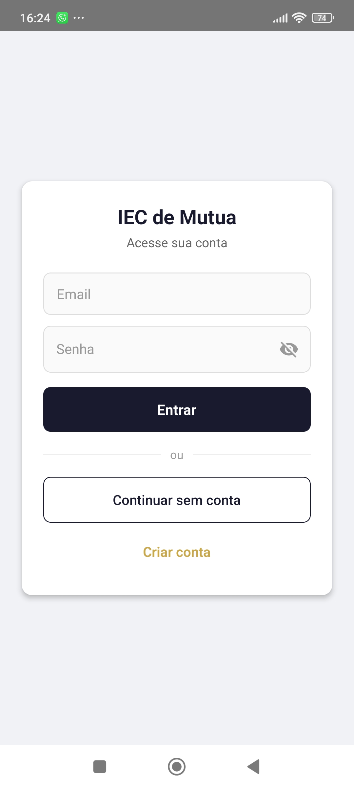</td>
    <td>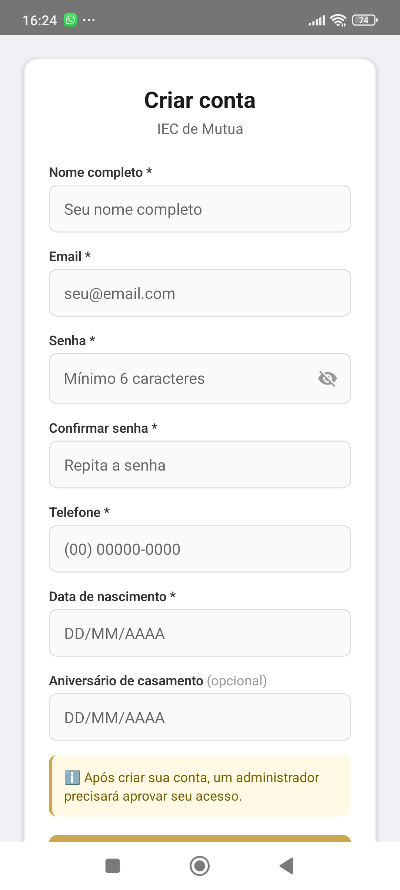</td>
    <td></td>
    <td>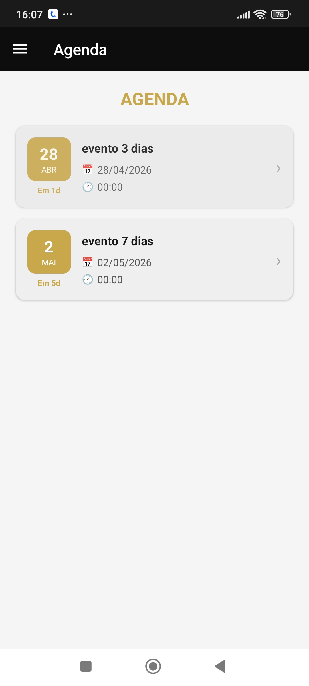</td>
  </tr>
  <tr>
    <td align="center"><b>Detalhe do Evento</b></td>
    <td align="center"><b>Bíblia — Livros</b></td>
    <td align="center"><b>Bíblia — Capítulos</b></td>
    <td align="center"><b>Bíblia — Leitura</b></td>
  </tr>
  <tr>
    <td>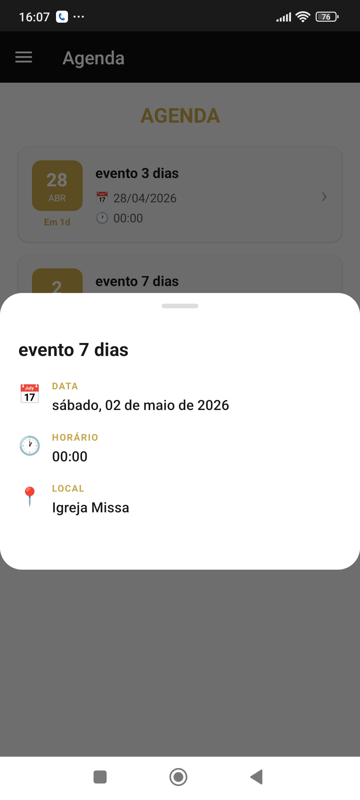</td>
    <td>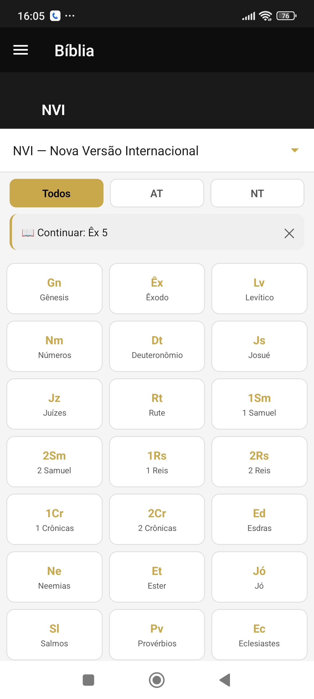</td>
    <td>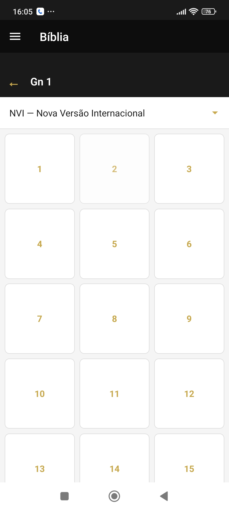</td>
    <td>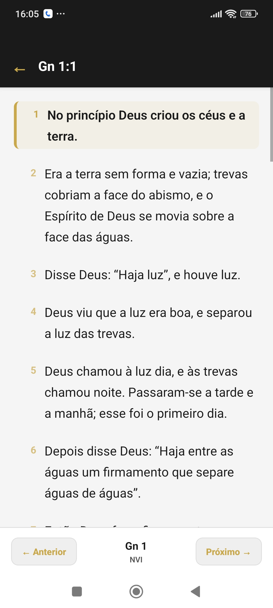</td>
  </tr>
  <tr>
    <td align="center"><b>Versões da Bíblia</b></td>
    <td align="center"><b>Pedido de Oração</b></td>
    <td align="center"><b>Doação / Pix</b></td>
    <td align="center"><b>Cultos no Lar</b></td>
  </tr>
  <tr>
    <td>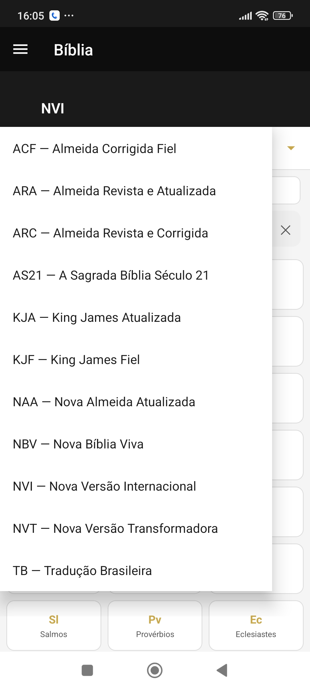</td>
    <td>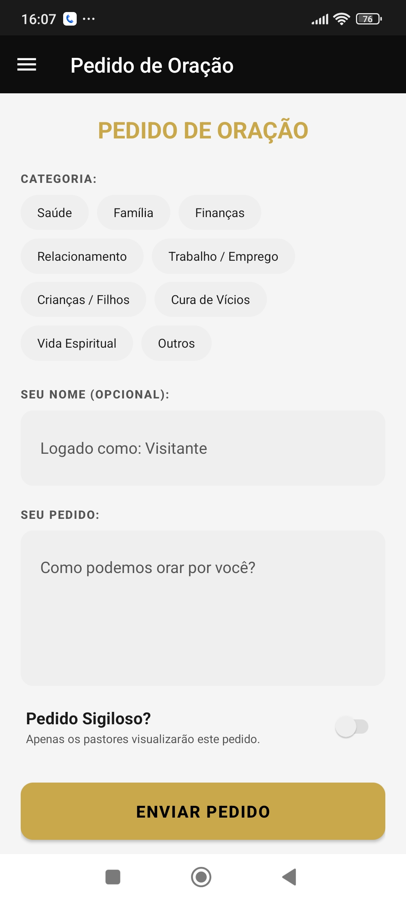</td>
    <td>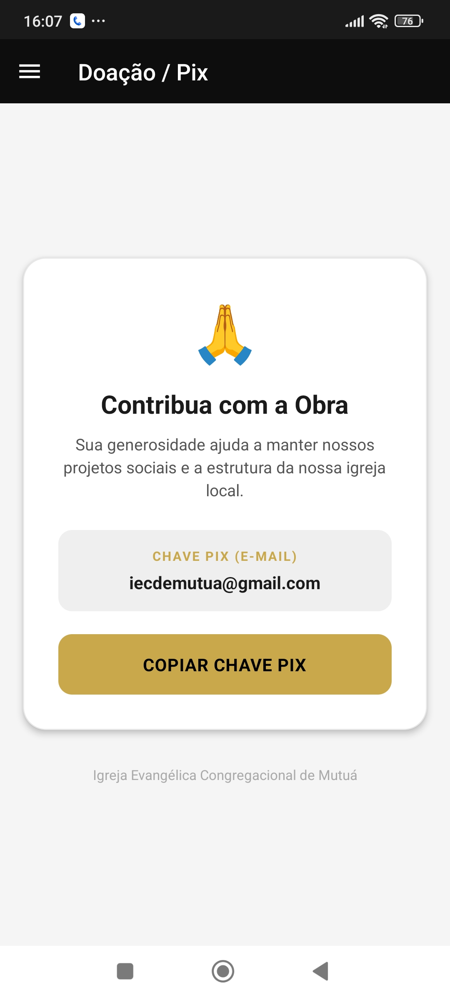</td>
    <td></td>
  </tr>
  <tr>
    <td align="center"><b>Quem Somos</b></td>
    <td align="center"><b>Painel Admin</b></td>
    <td></td>
    <td></td>
  </tr>
  <tr>
    <td></td>
    <td>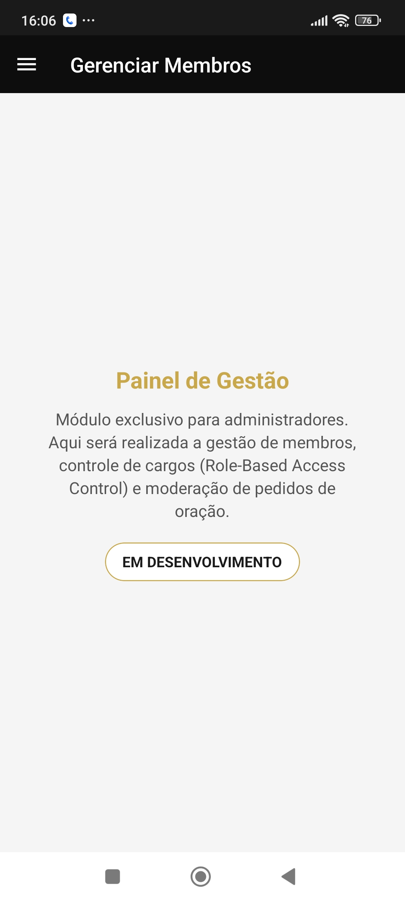</td>
    <td></td>
    <td></td>
  </tr>
</table>

### Tema Escuro

<table>
  <tr>
    <td align="center"><b>Início</b></td>
    <td align="center"><b>Bíblia</b></td>
    <td align="center"><b>Agenda</b></td>
    <td align="center"><b>Pedido de Oração</b></td>
  </tr>
  <tr>
    <td>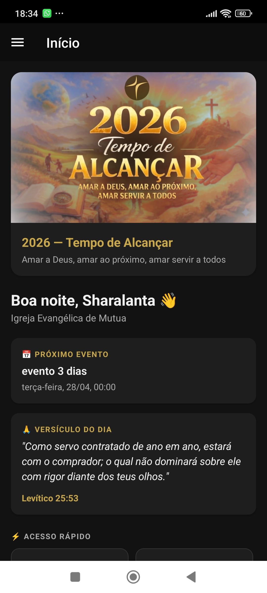</td>
    <td>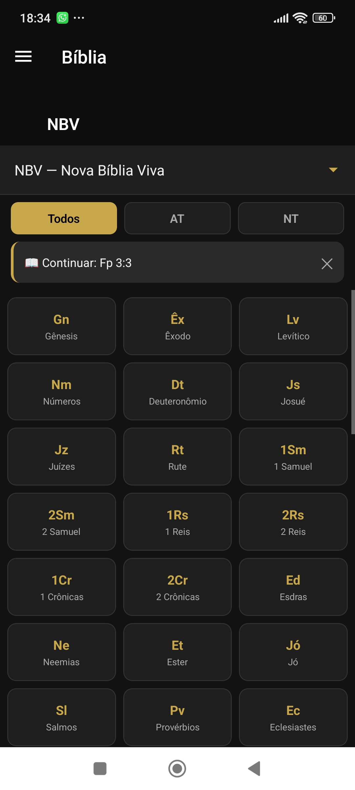</td>
    <td>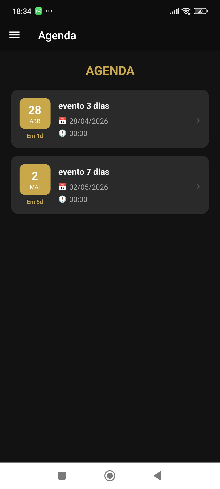</td>
    <td></td>
  </tr>
</table>

> 📸 *Screenshots do tema escuro serão adicionadas em breve.*

<br>

---

## 🚀 Funcionalidades

### Disponível para todos (visitantes)
- 📖 **Bíblia Offline** — 11 versões completas via SQLite local, sem internet
- 📅 **Agenda** — eventos públicos com notificações automáticas
- 🙏 **Pedido de Oração** — envio anônimo ou identificado com categorias
- 💛 **Doação / Pix** — chave Pix com cópia rápida
- 🌐 **Redes Sociais** — acesso direto ao Instagram e Facebook da igreja
- ℹ️ **Quem Somos** — missão, visão e liderança da igreja

### Exclusivo para membros autenticados
- 🏠 **Cultos no Lar** — lista de células com localização no mapa
- 📅 **Eventos privados** — agenda com visibilidade controlada por role
- 🔔 **Lembretes automáticos** — notificações 7, 3, 1 dia e no dia do evento

### Exclusivo para administradores
- 🔐 **Painel de Gestão** — controle de membros e moderação de pedidos *(em desenvolvimento)*

<br>

---

## 🏗️ Arquitetura

```
src/
├── contexts/
│   └── AuthContext.js         # Autenticação Firebase + controle de roles
├── navigation/
│   ├── RootNavigator.js       # Roteamento principal
│   ├── AuthStack.js           # Fluxo de login/cadastro
│   ├── VisitorDrawer.js       # Drawer para visitantes
│   ├── MemberDrawer.js        # Drawer para membros
│   └── AdminDrawer.js         # Drawer para administradores
├── screens/
│   ├── shared/                # Telas acessíveis a todos os perfis
│   │   ├── HomeScreen.js
│   │   ├── BibliaScreen.js
│   │   ├── AgendaScreen.js
│   │   ├── OracaoScreen.js
│   │   ├── DoacaoScreen.js
│   │   └── QuemSomosScreen.js
│   ├── member/                # Telas exclusivas para membros
│   │   └── CultosScreen.js
│   ├── admin/                 # Telas exclusivas para administradores
│   │   └── GerenciarScreen.js
│   ├───auth
│   │    ├──CadastroScreen.js
│   │    └──LoginScreen.js
│   └───ReadingScreen
│ 
│ 
├── services/
│   ├── firebase.js
│   ├── BibleService.js        # Motor SQLite da Bíblia (op-sqlite)
│   ├── BibleStorage.js        # Persistência de posição de leitura
│   └── api.js                 # Instância Axios (bible-api.com)
├── hooks/
│   └── useBible.js            # Hook customizado da Bíblia
├── components/
│   ├── agenda/
│   │   └── EventoModal.js    # Modal de detalhe de eventos
│   ├── bible/
│   │   └── VersionSelector.js
│   └── CustomDrawerContent.js 
│         
├── themes/
│   └── index.js               # Tokens de design (Dark/Light)
├── utils/
│    └── constants/
│        ├── Bibles.js          # Catálogo de versões da Bíblia
│        ├──PedidosDeOracao.js   
│        └──QuemSomos.js
```

<br>

---

## 🛠️ Stack Técnica

| Camada | Tecnologia |
|---|---|
| Framework | React Native 0.74.5 |
| Autenticação | Firebase Auth (`@react-native-firebase/auth` v20) |
| Banco de dados cloud | Cloud Firestore (`@react-native-firebase/firestore` v20) |
| Banco de dados local | SQLite via `@op-engineering/op-sqlite` |
| Persistência local | AsyncStorage |
| Navegação | React Navigation 7 (Stack + Drawer) |
| Notificações | Notifee (trigger notifications com AlarmManager) |
| HTTP Client | Axios (versículo do dia — bible-api.com) |
| Animações | React Native Animated API |

<br>

---

## 🎨 Identidade Visual

| Token | Claro | Escuro |
|---|---|---|
| Primary (Dourado) | `#C9A84C` | `#C9A84C` |
| Background | `#F5F5F5` | `#121212` |
| Surface | `#FFFFFF` | `#1E1E1E` |
| Text | `#1A1A1A` | `#FFFFFF` |

<br>

---

## 📖 Motor da Bíblia

A Bíblia funciona **100% offline** via banco SQLite empacotado no app:

- **11 versões** disponíveis: ACF, ARA, ARC, AS21, KJA, KJF, NAA, NBV, NVI, NVT, TB
- Navegação por Livro → Capítulo → Versículo
- Filtro por Antigo e Novo Testamento
- Persistência da última posição de leitura
- Destaque visual do versículo selecionado
- Navegação entre capítulos com setas (← →) com transição automática entre livros

> O banco de dados não está incluído no repositório por questão de tamanho. [Baixar aqui.](https://drive.google.com/drive/folders/1ZCMlu4jjkgjF5FE2hSosqMPlT_QVA8Jt?usp=sharing)

<br>

---

## ☁️ Estrutura do Firestore

```
/agenda/{evento(number)}
  ├── name: string
  ├── dateStart: timestamp
  ├── dateEnd: timestamp
  ├── address: string
  ├── description: string
  ├── status: "ativo" | "inativo"
  └── visibility: 0 (público) | 1 (membros) | 2 (admin)

/config/themeOfYear
  ├── title: string
  ├── verse: string
  └── imageUrl: string

/users/{usersId}
  ├── birthDate: timestamp
  ├── createdAt: timestamp
  ├── createdBy: string
  ├── email: string
  ├── name: string
  ├── phone: string
  ├── weddingAnniversary: timestamp
  └── role: "visitante" | "pendente" | "membro" | "admin"

/pedidos/{pedidosId}
  ├── categoria: string
  ├── dataCriacao: timestamp
  ├── isPrivado: boolean
  ├── status: "pending" | "sent" | "archived"
  ├── texto: string
  ├── userName:string
  └── userId: string
  

/churches/iecdemutu/addresses/{address(number)}
  ├── order: int64
  ├── name: string
  └── address: string

/pastores/{pastorId}
  ├── nome: string
  ├── cargo: string
  ├── fotoUrl: string
  ├── bio: string
  └── ordem: int64
```

<br>

---

## ⚙️ Como Rodar

```bash
# 1. Clone o repositório
git clone https://github.com/samircamposlima/iecdemutua.git
cd iecdemutua

# 2. Instale as dependências
npm install

# 3. Configure o Firebase
# Adicione o arquivo google-services.json em android/app/

# 4. Adicione os bancos da Bíblia
# Baixe os arquivos .db e coloque em android/app/src/main/assets/bibles/

# 5. Rode no Android
npx react-native run-android
```

<br>

---

## 📦 Build de Release

```bash
cd android
.\gradlew assembleRelease
# APK gerado em: android/app/build/outputs/apk/release/
```

**Especificações do build:**
- Versão: 1.0.0
- Compatibilidade: Android 7.0 (API 24) ou superior
- Tamanho: ~90MB (inclui 11 versões da Bíblia em SQLite)

<br>

---

## 🔐 Sistema de Roles

| Role | Acesso |
|---|---|
| `visitante` | Telas públicas — sem login |
| `pendente` | Aguardando aprovação do administrador |
| `membro` | Telas públicas + cultos no lar + eventos privados |
| `admin` | Acesso completo + painel de gestão |

<br>

---

*Desenvolvido por um Desenvolvedor Junior focado em Mobile — React Native & Android/Kotlin.*
